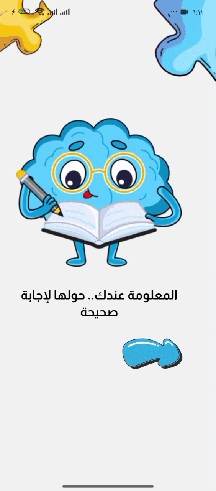

# 🧠 Brain Game - Interactive Onboarding Experience 🎮

Welcome to the **Brain Game** mobile application! This project is a high-performance educational game built with **React Native** and **Expo**, focusing on a premium user experience, clean architecture, and smooth interactive elements.

---

## 🚀 Recent Feature: Interactive Onboarding & Clean Fluid Architecture
In the latest `feature/onboarding` branch, I implemented a fully custom onboarding experience that bridges the gap between design and functionality, alongside a production-ready scaling architecture.

### ✨ Key Implementation Details:
* **Fluid Spacing Architecture:** Replicated the CSS `clamp()` behavior inside NativeWind using runtime-calculated viewport widths to scale layouts seamlessly across multiple physical phone dimensions and tablets without breaking the Node compiler.
* **Semantic Design Tokens:** Centralized color configurations and responsive spacing properties into `tailwind.config.js` to eliminate hardcoded inline hex values (`#F5F5F5`) and fixed pixel rules.
* **High-Scannability Component Layouts:** Refactored utility clutter by separating structural Tailwind classes into clean style lookup dictionaries (e.g., `styles.headerContainer`), improving long-term maintainability.
* **3D UI Components:** Custom-built navigation buttons with a 3D tactile effect using `react-native-svg`.
* **Cross-Platform Fixes:** Bypassed the native Windows ESM absolute path protocol bug (`ERR_UNSUPPORTED_ESM_URL_SCHEME`) by configuring the Metro environment with accurate Node module file path parameters.
* **Audio Integration:** Added interactive feedback using custom audio hooks (`expo-audio`) resolving `.wav` and `.mp3` extension matrices securely.

---

## 🛠️ Technical Stack
* **Framework:** [Expo](https://expo.dev/) (SDK 51+)
* **Styling:** [NativeWind](https://www.nativewind.dev/) (v4 + Tailwind CSS)
* **Graphics:** SVG Assets via `react-native-svg-transformer/expo`
* **Audio Resolution:** Custom Metro asset mapping for game sounds
* **State Management:** Redux Toolkit
* **Storage:** AsyncStorage (for onboarding persistence)
* **Typography:** Almarai (Arabic typography integration)

---

## 🎬 Interaction Demo

<p align="center">
  
</p>

## 🏗️ Project Structure (Relevant Modules)
```bash
brain-app/
├── app/
│   └── (game)/
│       └── index.tsx          # Game screen layouts using fluid tokens
├── src/
│   ├── components/
│   │   ├── game/
│   │   │   └── letterTitle.tsx # Clean style-token refactored header
│   │   └── onboarding/
│   │       └── OnboardingItem.tsx
│   └── hooks/
│       └── use-sound.ts        # Dynamic interactive feedback wrapper
├── metro.config.js             # Fixed Windows-compatible module pipeline
└── tailwind.config.js          # Main design token & fluid scaling registry